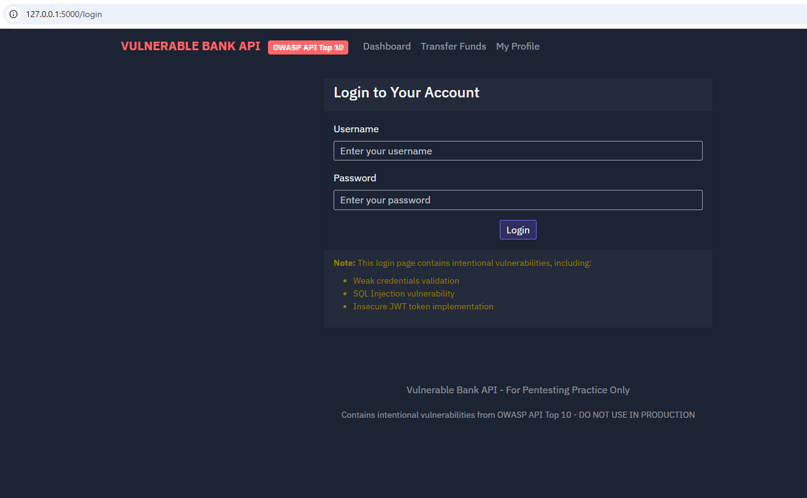
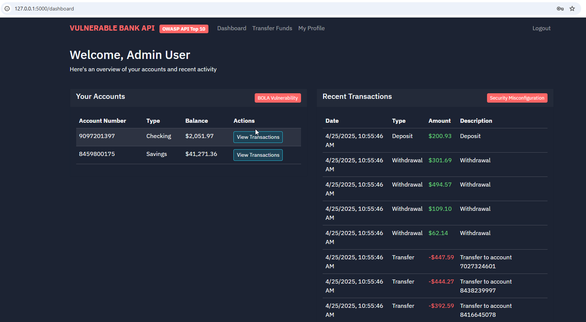

# 📘 Documentación de la API Bancaria Vulnerable




Esta aplicación es una API intencionalmente vulnerable que simula un sistema bancario. Ha sido diseñada específicamente para contener vulnerabilidades del OWASP API Top 10 (2023) con fines educativos y de pruebas de seguridad.

**⚠️ ADVERTENCIA: Esta aplicación es deliberadamente insegura y nunca debe desplegarse en un entorno de producción ni exponerse a internet.**

---

## 🛠 Pasos de instalación

## 🗂 Base de datos

La base de datos SQLite (`vulnerable_bank.db`) ya viene incluida con datos de ejemplo. No necesitas generar nada adicional.

### 1. Requisitos previos

- Python 3.7 o superior
- pip
- virtualenv (puede instalarse con `pip install virtualenv`)

### 2. Clonar el repositorio

```bash
git clone https://github.com/iaraoz/vulnerableBankAPI.git
cd vulnerableBankAPI
```

### 3. Crear y activar el entorno virtual

- En Linux/macOS:

```bash
virtualenv venv
source venv/bin/activate
```

- En Windows:

```bash
virtualenv .env
.env\Scripts\activate
```

### 4. Instalar dependencias

```bash
pip install -r requirements.txt
```

### 5. Ejecutar en entorno de desarrollo

```bash
flask run
```

### 6. Ejecutar en entorno de producción

- En Windows (modo desarrollo con Flask):

```cmd
set FLASK_APP=main.py
flask run
```


- En Linux (Gunicorn):

```bash
gunicorn --bind 0.0.0.0:5000 main:app
```
---

## 🧩 Visión general

La API Bancaria Vulnerable incluye las siguientes funcionalidades:

- Autenticación de usuarios (con vulnerabilidades)
- Gestión de cuentas
- Transferencia de fondos
- Historial de transacciones
- Gestión de perfil de usuario

---

## 🔓 Vulnerabilidades OWASP API Top 10

Esta aplicación incluye intencionalmente las siguientes vulnerabilidades:

### 1. Autorización rota a nivel de objeto (BOLA)
- Endpoints como `/api/accounts/<id>` no verifican correctamente la propiedad del usuario
- Los usuarios pueden acceder a cuentas que no les pertenecen

### 2. Autenticación rota
- Implementación débil de JWT sin expiración
- Almacenamiento inseguro de contraseñas (texto plano)
- Inyección SQL en el endpoint de login

### 3. Exposición excesiva de datos
- Los perfiles de usuario exponen datos sensibles como números de seguro social
- Los mensajes de error revelan detalles de implementación

### 4. Falta de control de recursos y limitación de tasa
- Sin límites en el número de peticiones a la API
- Sin paginación en los resultados de búsqueda

### 5. Autorización rota a nivel de funciones
- Algunas funciones de administrador como la creación de usuarios no tienen control adecuado de permisos

### 6. Asignación masiva
- Creación directa de objetos desde JSON sin filtrado de campos

### 7. Configuración insegura
- Modo debug activado
- Trazas de error visibles para el cliente
- Mensajes de error demasiado detallados

### 8. Inyección
- Inyección SQL en varios endpoints
- Consultas SQL sin protección usando datos del usuario

### 9. Gestión inadecuada de activos
- Endpoints antiguos como `/api/v1/transfer` aún accesibles
- Menor seguridad en versiones antiguas de la API

### 10. Falsificación de solicitudes del lado del servidor (SSRF)
- Comprobador de conectividad permite acceder a servicios internos

---

## 🔐 Autenticación

La autenticación se maneja mediante tokens JWT. Puedes iniciar sesión con una de las siguientes cuentas:

- Administrador: `admin` / `admin123`
- Gerente: `manager` / `manager456`
- Clientes:
  - `john.doe` / `password123`
  - `jane.smith` / `password456`
  - `bob.johnson` / `password789`
  - `alice.williams` / `passwordabc`